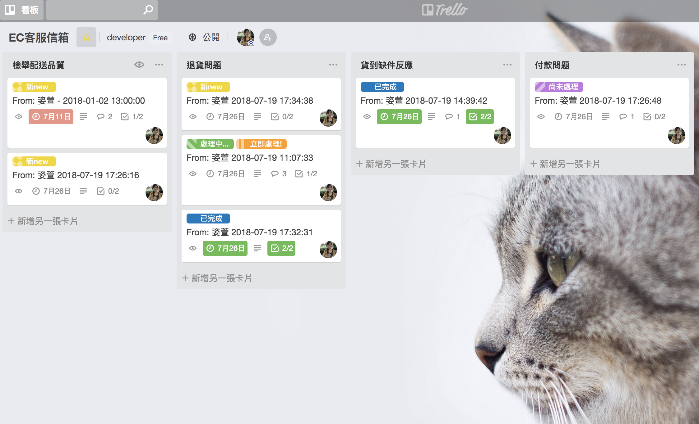
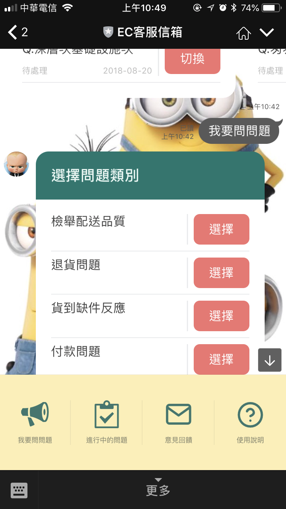
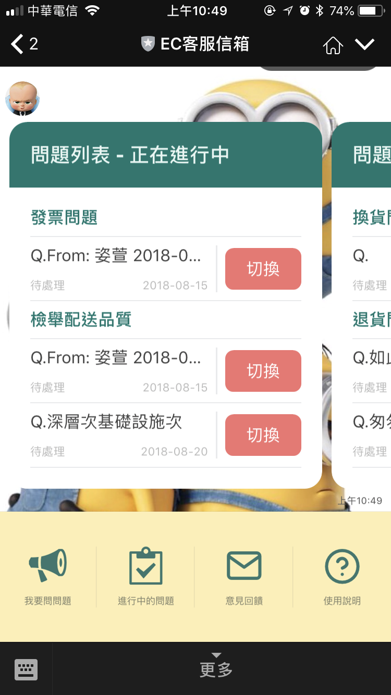
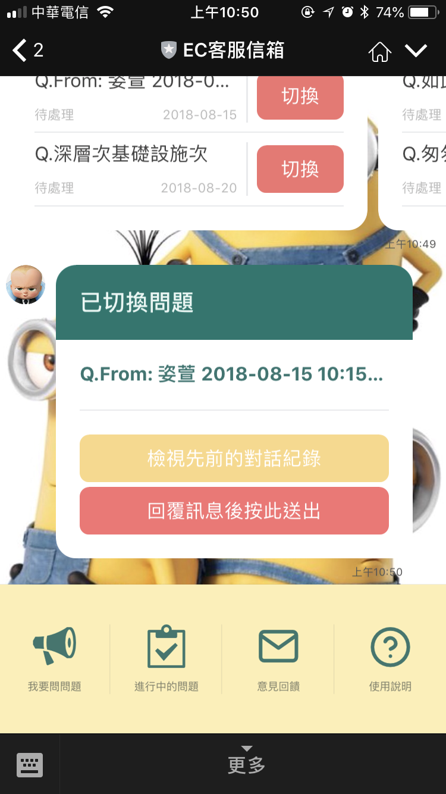
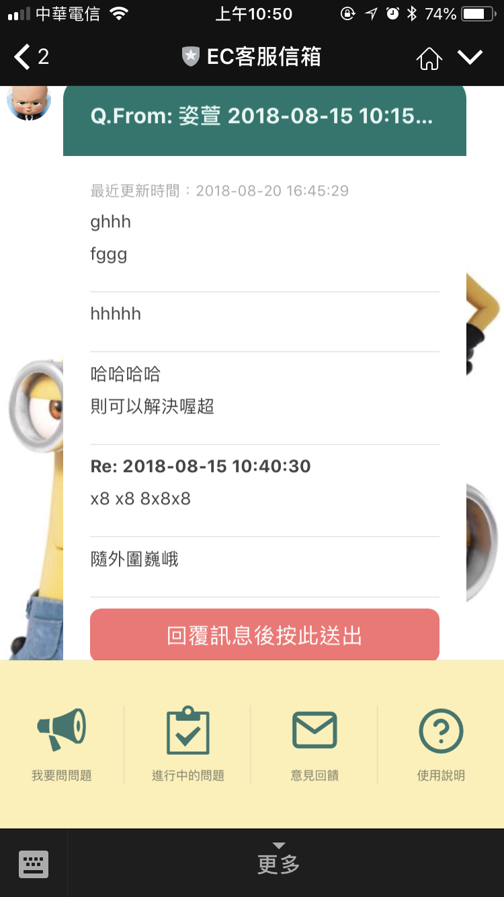
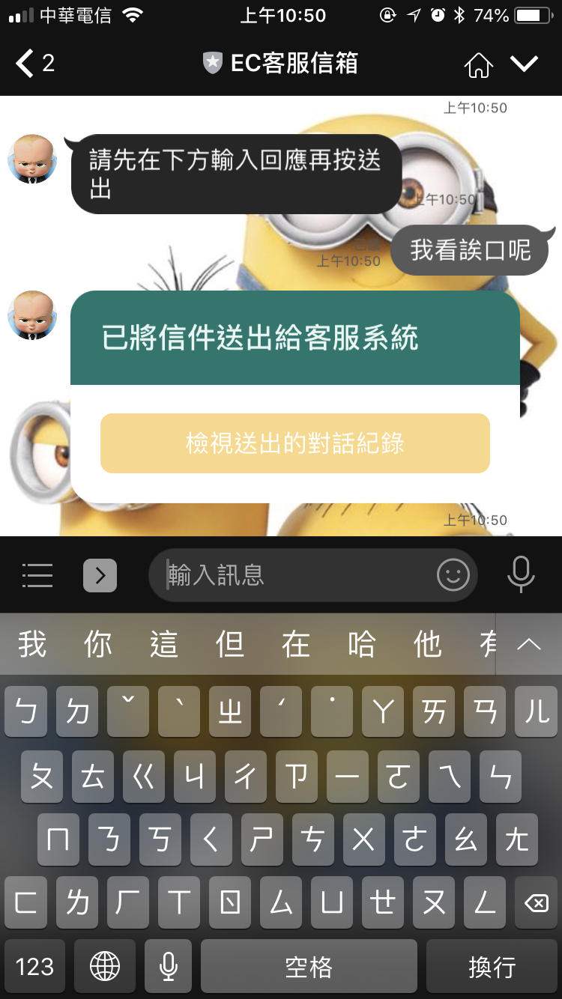
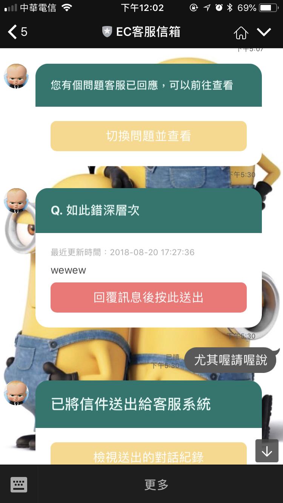
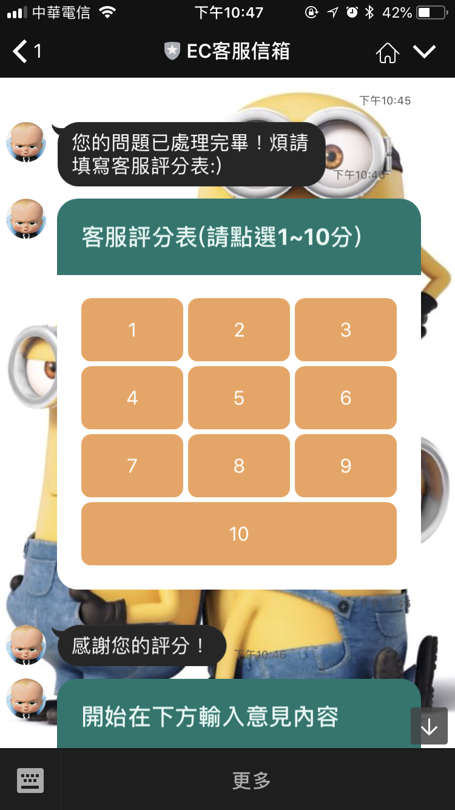
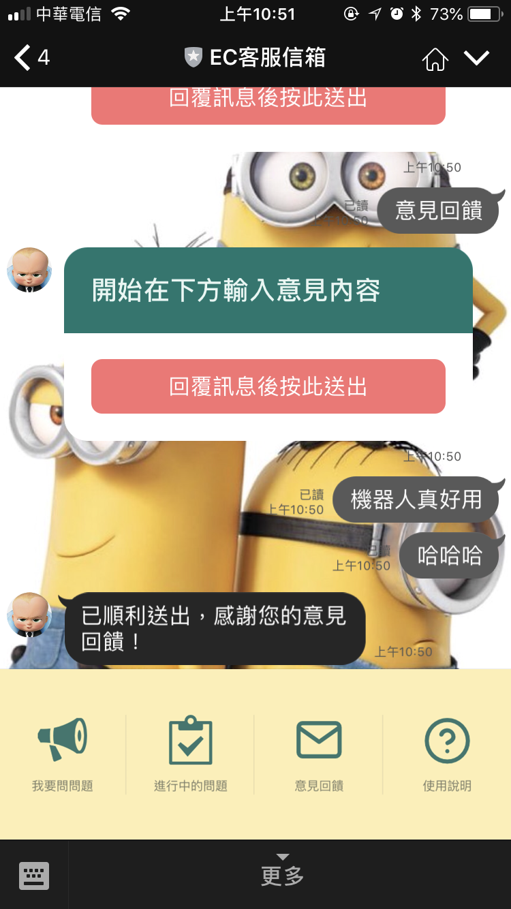

# 客服信箱
## 簡介
大多數電子商務網站中都設有客服信箱，但是對於我這種很懶惰又討厭客訴的人，若網站使用者體驗不佳還要先了解複雜的客訴流程，我希望透過大家最常溝通的管道"line"來進行整個客訴的流程，即能方便簡單的達到目的。

本專案除了使用lineBot, 還結合了目前盛行的Trello管理專案工具當作廠商的後台。

目前問題種類簡單分為：檢舉配送品質、退貨問題、貨到缺件反應、付款問題、換貨問題、維修保固問題、發票問題、我要申訴。
不同種類的問題可以分別指派給不同群的客服專員回答，當有人提出該分類的問題，便會發送通知給該專員回答，而每個問題都會有時間提醒，問題會依照時間有不同的標籤顏色警示。

## 技術
+ Linebot Api: https://developers.line.me/en/docs/messaging-api/overview/
+ Trello Api: https://developers.trello.com/v1.0/reference#introduction 

## 樣板
+ 自行設計，使用Line Flex template : https://developers.line.me/en/docs/messaging-api/flex-message-elements/

## trello客服後台

## Client端開始操作機器人摟！
### Step0. 打開下方 "更多" 選單
### Step1. 點選 "使用說明"，讓您更方便操作
+ 使用說明也會在一加入機器人後跳出
### Step2. 點選 "我要問問題", 開始回覆並送出訊息至Trello後台
+ 接著選擇問題分類後開始回覆
+ 後台收到機器人傳來的訊息，客服人員便會開始處理並回覆，若此問題尚未結束仍然可以問下一個問題(問題分類不拘)

<!-- 
 -->
  
<!-- 
 -->

### Step3. 當您一次有多個問題時，您可以點選 "進行中的問題"，並對尚未結束的問題進行切換

> 列表會顯示`問題進度狀態`，依照`分類`做排序

1. 進行中的問題列表

<!-- 
 -->
  
<!-- 
 -->

3. 點選"切換", 切換列表有以下兩個按鈕

<!-- 
 -->
  
<!-- 
 -->

+ 點選 "檢視先前的歷史紀錄"

<!-- 
 -->
  
<!-- 
 -->

+ 輸入問題後，再點選 "回覆訊息後按此送出"

+ 送出成功

<!-- 
 -->
  
<!-- 
 -->

+ 客服回覆後傳送至機器人，可以針對回覆繼續一來一往的回答雙方問題

### Step4. 若有多個問題進行中，客服回覆問題後傳送給機器人會錯亂
1. 若當前的問題為"Q1"，而客服那邊回覆了您先前問的問題"Q2"，會跳出插播，詢問是否切換問題並查看問題回覆

### Step5. 問題完成後請填寫客服評分表
+ 當某個問題客服人員於後台標注完成，則會傳送給機器人表示該問題已完成，並送出問題評分表
+ 此評分表會針對此問題跟回答的客服人員做評分

### Step6. 點選 "意見回饋"
1. 回覆後，點選 "送出鈕"

<!-- 
 -->
  
<!-- 
 -->

